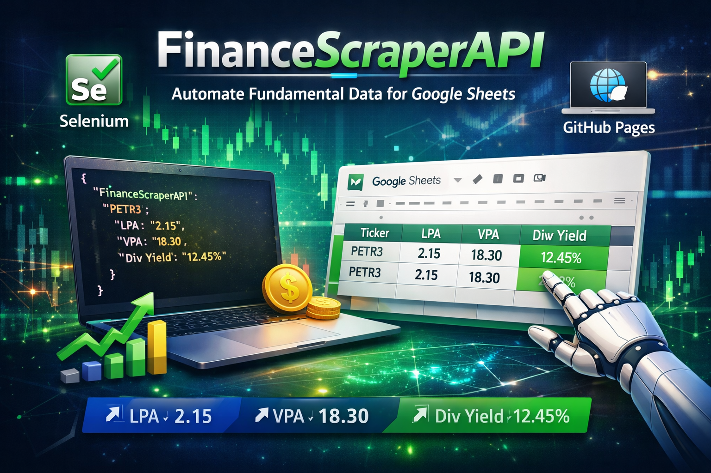
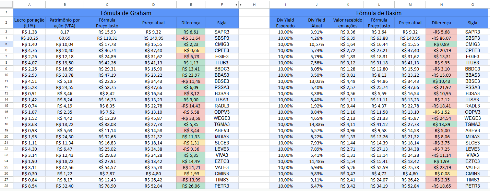
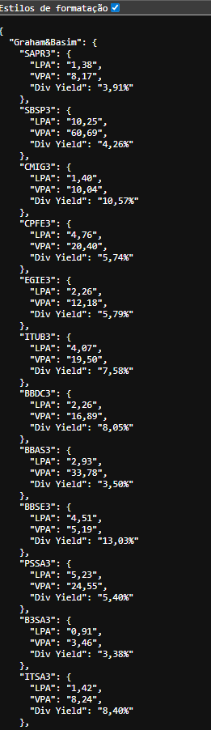

<h1 align="center"> FinanceScraperAPI </h1>

  

---

## 📚 Sumário

### [📌 Sobre o projeto](#sobre)
### [🧰 Tecnologias Utilizadas](#TecnologiasUtilizadas)
### [💻 Como utilizar o ClassManager](#ComoRodar)
### [📷 Imagens do sistema](#ImagensDoSistema)
### [📞 Contato e Créditos](#CreditosEContato)

## 📌 Sobre o projeto

### O FinanceScraperAPI é uma solução automatizada para coleta e disponibilização de indicadores fundamentalistas de ações, como VPA (Valor Patrimonial por Ação), LPA (Lucro por Ação) e Dividend Yield (DivY).

### 💡 O projeto surgiu para contornar uma limitação do Google Finance, que não disponibiliza esses indicadores diretamente em planilhas do Google Sheets.

---

## ⚙️ Como funciona?

### Um script automatizado utilizando web scraping com Selenium coleta os dados das ações desejadas.

### Os dados são estruturados e versionados no repositório.

### Em seguida, são disponibilizados como uma API estática via GitHub Pages.

### Essa API é consumida diretamente no Google Sheets, permitindo criar fórmulas personalizadas para análise de investimentos.

## 🎯 Objetivo

### Criar uma ponte entre dados financeiros indisponíveis em ferramentas tradicionais e o ambiente de análise do usuário, permitindo:

### Automatização de análise fundamentalista

### Atualização prática de indicadores

### Integração com planilhas financeiras

### Independência de APIs pagas

## 🧠 Diferencial do projeto

### Resolve um problema real do mercado financeiro

### Integra automação + scraping + API + planilhas

### Não depende de serviços pagos

### Arquitetura simples, porém extremamente eficiente

## 🧰 Tecnologias Utilizadas

### 🤖 Automação & Coleta de Dados

Utilizado para automatizar a navegação e extração de dados diretamente de sites financeiros.
 
 

### 🌐 API & Distribuição

Responsável por hospedar os dados em formato JSON, simulando uma API pública acessível via HTTP. Formato leve e estruturado utilizado para disponibilizar os dados coletados.

  

### 📊 Consumo e Integração

Utilizado para consumir a API e montar dashboards e análises financeiras personalizadas.

 
Permite integrar chamadas HTTP dentro da planilha, automatizando a leitura dos dados da API.

## 💻 Como utilizar o projeto

### ✅ 1. Clone o repositório

git clone https://github.com/seu-usuario/FinanceScraperAPI.git  
cd stockmetrics-api

---

### ✅ 2. Instale as dependências

Certifique-se de ter o **Python 3** instalado e execute:

pip install selenium

---

### ✅ 3. Instale o navegador e o driver

O projeto utiliza o **Google Chrome** em modo headless.

Você precisa ter:

- Google Chrome instalado  
- ChromeDriver compatível com sua versão  

---

### ✅ 4. Configure os ativos (tickers)

No código, localize a variável:

TICKERS = [
    "PETR3", "VALE3", "ITUB3"
]

Adicione ou remova as ações conforme sua necessidade.

---

### ✅ 5. Entenda o funcionamento do cache

O script utiliza um arquivo local:

gitPages.json

Esse arquivo:

- Armazena os dados coletados  
- Evita perda de informações anteriores  
- Estrutura os dados no formato de "API"  

Exemplo de saída:

{
  "FinanceScraperAPI": {
    "PETR3": {
      "LPA": "2,15",
      "VPA": "18,30",
      "Div Yield": "12,45%"
    }
  }
}

---

### ✅ 6. Execute o script

python main.py

O script irá:

- Acessar o site Status Invest  
- Coletar os dados de cada ação:
  - Dividend Yield  
  - LPA  
  - VPA  
- Aplicar tratamento (ex: troca de ponto por vírgula)  
- Atualizar o arquivo gitPages.json  

---

### ✅ 7. Como os dados são gerados

Para cada ticker, o sistema:

- Abre a página da ação  
- Aguarda entre 3 a 6 segundos (delay aleatório)  
- Faz scraping usando XPath  
- Armazena os dados estruturados em JSON  

---

### ✅ 8. Publicação como "API"

Após rodar o script:

1. Faça commit do arquivo gitPages.json  
2. Envie para o repositório:

git add .  
git commit -m "update data"  
git push  

3. Ative o GitHub Pages no repositório  

Agora o JSON estará disponível via URL pública, funcionando como uma API.

---

### ✅ 9. Integração com Google Sheets

Você pode consumir os dados usando:

- Apps Script (UrlFetchApp)  
- Ou funções personalizadas  

Isso permite montar dashboards automáticos com:

- Dividend Yield  
- LPA  
- VPA  

---

### ⚠️ Observações importantes

- O scraping depende da estrutura do site  
- Mudanças no layout podem quebrar o código  
- O uso de time.sleep ajuda a evitar bloqueios  
- O script roda em modo headless (sem abrir o navegador)  

## 📷 Imagens do sistema

<table>
  <tr>
    <td align="center"><strong>Planilha Google Sheets</strong></td>
  </tr>
  <tr>
    <td align="center"></td>
  </tr>
  <tr>
    <td align="center"><strong>GitHubPages como API</strong></td>
  </tr>
  <tr>
    <td align="center"> q
  </tr>
</table>

## 📞 Créditos e Contato

<h3> Desenvolvido por <a href= https://rincon23.github.io/>Enzo Rincon</a></h3> 

📍 Localização: São Paulo 

💼 Áreas de interesse: Desenvolvimento Fullstack.

📢 Aberto a oportunidades profissionais na área de desenvolvimento

---

### 📬 Como entrar em contato?

Curtiu o projeto? Quer dar um feedback, trocar ideia sobre tecnologia ou até falar de vagas?

Tô sempre aberto a conversar! É só me chamar nos links aí embaixo 👇

<table> 
    <tr>
        <td><strong>📧 E-mail:</strong></td> 
        <td><a href="mailto:enzorincon2003@gmail.com">enzorincon2003@gmail.com</a></td> 
    </tr>
    <tr> 
        <td><strong>💼 LinkedIn:</strong></td> 
        <td><a href="https://www.linkedin.com/in/enzorincon">linkedin.com/in/enzorincon</a></td> 
    </tr> 
    <tr> 
        <td><strong>📷 Instagram:</strong></td> 
        <td><a href="https://www.instagram.com/enzo.rincon">@enzo.rincon</a></td> 
    </tr> 
    <tr> 
        <td><strong>🌐 Portifólio:</strong></td> 
        <td><a href="https://rincon23.github.io/">https://rincon23.github.io/</a></td> 
    </tr> 

</table>

---

⭐ Obrigado por visitar este projeto! ⭐
